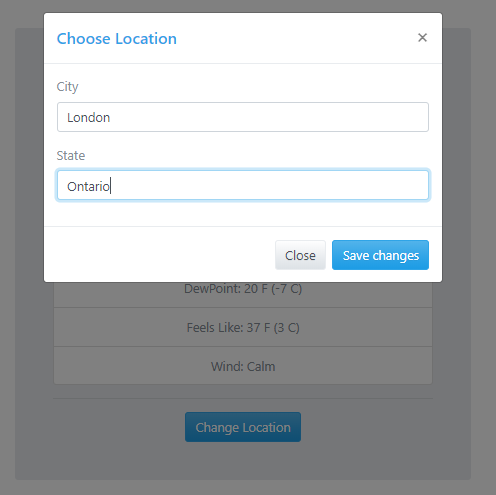
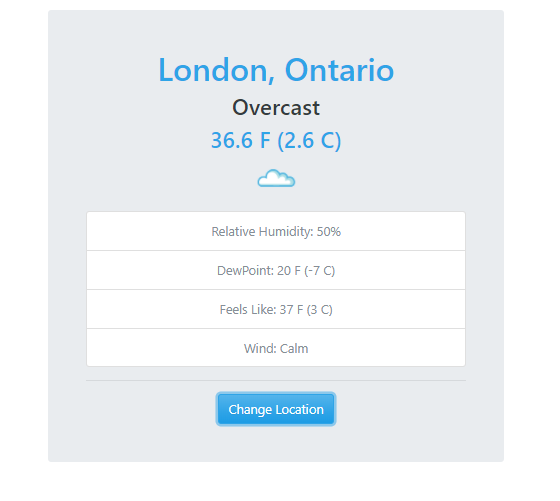

# appWeather_API

A Simple App that finds the weather using the City and State to search it.
It was made using OOP and pure prototypal inheritance and my 'fetch' framework. 

You can reload the page because the app send data to local storage. 

I'm using the API from wunderground.com 

:sunny: :umbrella: :cloud: :snowman:
___

___

___
